---
tags:
  - project
  - desktop
  - tauri
  - rust
  - 执行文档
created: 2026-05-08
status: 规划中
---

# ModulaDesk — 项目执行文档

> 模块化桌面工作台，基于 Rust + Tauri 2.x + Vue 3

---

## 一、项目概述

### 是什么
一个 Windows 桌面模块化工作台。桌面被划分为可自由排列的格子，每个格子是一个独立模块，支持热拔插。模块可以是文件展示、工具组件、甚至嵌入应用界面。

### 不是什么
- 不是桌面整理工具（不是 Fences/腾讯桌面助手的替代品）
- 不是启动器（不是 Flow Launcher/Wox 的替代品）
- 不是壁纸引擎

### 核心理念
```
手机桌面的小组件思维 + VS Code 的插件架构 + Web 的自由度
```

---

## 二、整体架构

### 系统组成

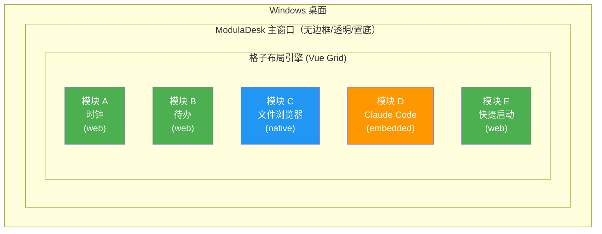

### 分层架构

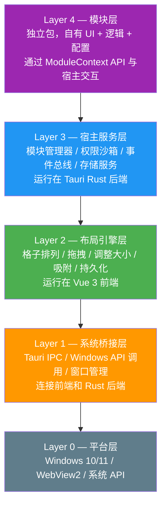

---

## 三、技术栈

| 层 | 技术 | 说明 |
|---|------|------|
| 前端框架 | Vue 3 + TypeScript | 响应式 UI，组件化 |
| 构建工具 | Vite | 快速开发热重载 |
| 状态管理 | Pinia | 全局状态（布局、模块列表） |
| 格子布局 | vue-grid-layout 或自研 | 拖拽、调整大小、响应式 |
| 后端框架 | Rust + Tauri 2.x | 系统调用、IPC、窗口管理 |
| Windows API | windows-rs | 原生 API 绑定 |
| 模块沙箱 | WebView2 隔离 + 权限控制 | 每个模块独立 WebView |
| 配置存储 | JSON 文件（初期）→ SQLite（后期） | 布局、模块配置、持久化数据 |
| 包格式 | ZIP（manifest + 代码 + 资源） | 模块分发格式 |

---

## 四、目录结构

```
ModulaDesk/
├── src/                          # Vue 3 前端
│   ├── components/
│   │   ├── GridEngine.vue        # 格子布局引擎
│   │   ├── GridCell.vue          # 单个格子容器
│   │   ├── ModuleLoader.vue      # 模块加载/渲染
│   │   ├── TopBar.vue            # 顶部工具栏（添加模块、设置）
│   │   └── Settings.vue          # 全局设置面板
│   ├── composables/
│   │   ├── useGrid.ts            # 格子布局逻辑
│   │   ├── useModule.ts          # 模块生命周期管理
│   │   └── useTheme.ts           # 主题/样式
│   ├── stores/
│   │   ├── layout.ts             # 布局状态（格子位置、大小）
│   │   ├── modules.ts            # 已加载模块列表
│   │   └── settings.ts           # 全局设置
│   ├── types/
│   │   └── module.ts             # 模块接口定义（Module, ModuleContext, Manifest）
│   ├── App.vue
│   └── main.ts
│
├── src-tauri/                    # Rust 后端
│   ├── src/
│   │   ├── commands/
│   │   │   ├── mod.rs
│   │   │   ├── module.rs         # 模块加载/卸载/列表
│   │   │   ├── storage.rs        # 持久化存储
│   │   │   ├── file.rs           # 文件操作
│   │   │   └── system.rs         # 系统调用
│   │   ├── core/
│   │   │   ├── mod.rs
│   │   │   ├── module_manager.rs # 模块管理器
│   │   │   ├── sandbox.rs        # 权限沙箱
│   │   │   ├── event_bus.rs      # 事件总线
│   │   │   └── window.rs         # 窗口管理（置底、透明等）
│   │   ├── utils/
│   │   │   ├── mod.rs
│   │   │   └── config.rs         # 配置读写
│   │   ├── main.rs
│   │   └── lib.rs
│   ├── Cargo.toml
│   └── tauri.conf.json
│
├── modules/                      # 内置模块（开发阶段）
│   ├── clock/
│   │   ├── manifest.json
│   │   ├── index.ts
│   │   └── ui/
│   ├── file-explorer/
│   │   ├── manifest.json
│   │   ├── index.ts
│   │   └── ui/
│   └── todo/
│       ├── manifest.json
│       ├── index.ts
│       └── ui/
│
├── package.json
├── vite.config.ts
├── tsconfig.json
└── README.md
```

---

## 五、模块接口规范

### 5.1 模块目录结构

```
modules/
├── clock/                    # 一个模块
│   ├── manifest.json         # 模块元信息
│   ├── index.ts              # 模块入口
│   ├── settings.json         # 用户配置（运行时生成）
│   └── ui/                   # 前端资源（可选）
│       ├── index.html
│       ├── style.css
│       └── main.js
├── file-explorer/
│   ├── manifest.json
│   ├── index.ts
│   └── ui/
└── claude-code/
    ├── manifest.json
    ├── index.ts
    └── ui/
```

### 5.2 manifest.json — 模块元信息

```jsonc
{
  "id": "clock",                    // 唯一标识
  "name": "时钟",                   // 显示名称
  "version": "1.0.0",
  "author": "judy",
  "description": "桌面时钟小组件",
  "icon": "🕐",                    // 图标（emoji 或 svg 路径）

  // 格子约束
  "grid": {
    "minWidth": 2,                  // 最小占几格（格子单位）
    "minHeight": 1,
    "maxWidth": 4,                  // 最大占几格
    "maxHeight": 2,
    "defaultWidth": 2,              // 默认大小
    "defaultHeight": 1,
    "resizable": true               // 是否可调整大小
  },

  // 模块类型
  "type": "web",                    // "web" | "native" | "embedded"
  // web: 纯前端 HTML/CSS/JS
  // native: Rust 后端逻辑 + 前端 UI
  // embedded: 嵌入外部应用窗口

  // 权限声明（按需申请）
  "permissions": [
    "file:read",                    // 读文件
    "file:write",                   // 写文件
    "network:http",                 // HTTP 请求
    "system:clipboard",             // 剪贴板
    "system:shell"                  // 执行命令
  ],

  // 配置项 schema（渲染设置面板用）
  "settings": {
    "format24h": {
      "type": "boolean",
      "default": true,
      "label": "24 小时制"
    },
    "showSeconds": {
      "type": "boolean",
      "default": false,
      "label": "显示秒数"
    }
  }
}
```

### 5.3 Module 生命周期

```typescript
export interface Module {
  // === 生命周期 ===
  /** 模块被添加到格子时调用（只一次） */
  onInit?(ctx: ModuleContext): Promise<void>;

  /** 模块 UI 挂载到 DOM 时调用（每次显示） */
  onMount?(ctx: ModuleContext): Promise<void>;

  /** 模块 UI 从 DOM 卸载时调用（每次隐藏） */
  onUnmount?(): Promise<void>;

  /** 模块被移除时调用（只一次，清理资源） */
  onDestroy?(): Promise<void>;

  // === 事件 ===
  /** 格子大小变化时调用 */
  onResize?(width: number, height: number): void;

  /** 用户修改设置时调用 */
  onSettingsChange?(key: string, value: any): void;

  /** 收到其他模块或系统消息时调用 */
  onMessage?(type: string, payload: any): void;
}
```

### 5.3.1 模块生命周期流程图

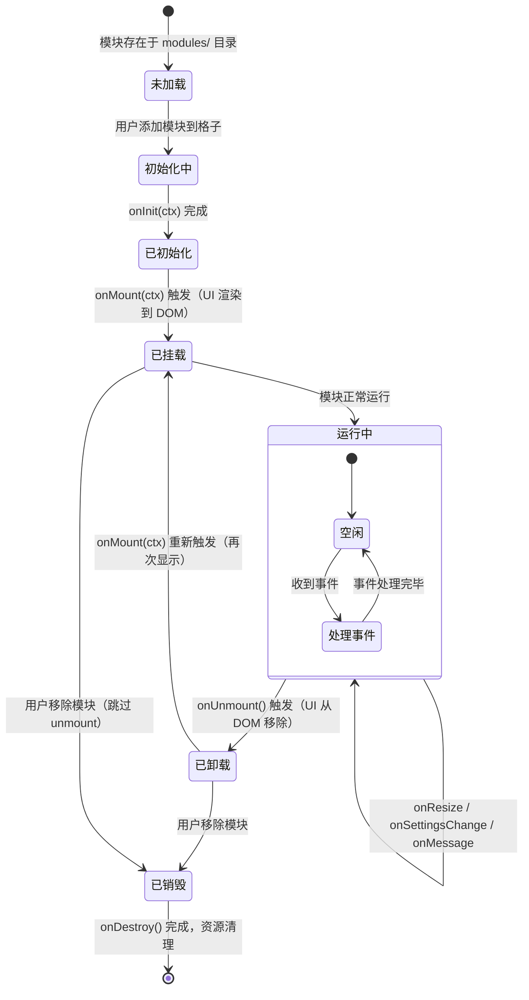

### 5.4 ModuleContext — 宿主提供给模块的能力

```typescript
export interface ModuleContext {
  /** 模块的唯一 ID */
  readonly moduleId: string;

  /** 模块的 DOM 挂载点 */
  readonly container: HTMLElement;

  /** 当前用户配置 */
  readonly settings: Record<string, any>;

  /** 读取/写入持久化数据 */
  storage: {
    get<T>(key: string): Promise<T | undefined>;
    set<T>(key: string, value: T): Promise<void>;
    delete(key: string): Promise<void>;
  };

  /** 向宿主（主窗口）发送消息 */
  emit(type: string, payload: any): void;

  /** 监听宿主消息 */
  on(type: string, handler: (payload: any) => void): () => void;

  /** 请求权限（运行时动态申请） */
  requestPermission(perm: string): Promise<boolean>;

  /** 调用系统能力（受限） */
  system: {
    readFile(path: string): Promise<string>;
    writeFile(path: string, content: string): Promise<void>;
    exec(command: string): Promise<{ stdout: string; stderr: string }>;
    clipboardRead(): Promise<string>;
    clipboardWrite(text: string): Promise<void>;
    httpGet(url: string): Promise<string>;
  };
}
```

### 5.5 ModuleManager — 宿主侧模块管理 API

```typescript
export interface ModuleManager {
  register(manifest: Manifest, module: Module): void;
  unregister(moduleId: string): void;
  load(modulePath: string): Promise<void>;      // 热加载
  unload(moduleId: string): Promise<void>;       // 热卸载
  list(): Manifest[];
  send(moduleId: string, type: string, payload: any): void;
  broadcast(type: string, payload: any): void;
  updateLayout(layout: GridLayout): void;
}
```

### 5.6 模块类型说明

| type | 渲染方式 | 适用场景 | 实现复杂度 |
|------|---------|---------|-----------|
| web | 纯 HTML/CSS/JS 在 WebView 中 | 时钟、天气、待办、笔记 | 低 |
| native | Rust 逻辑 + Vue UI | 文件管理、搜索、系统监控 | 中 |
| embedded | 嵌入外部窗口（SetParent/IPC） | Claude Code、终端 | 高 |

### 5.7 模块权限沙箱

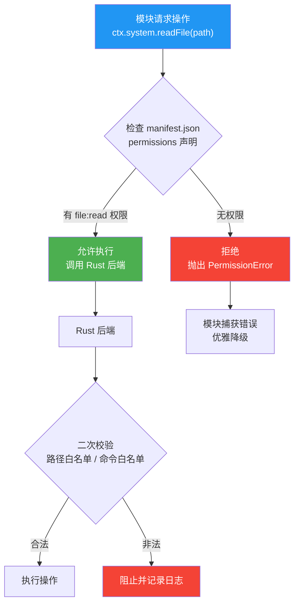

---

## 六、环境搭建

### 6.1 前置依赖

```bash
# Rust 工具链
curl --proto '=https' --tlsv1.2 -sSf https://sh.rustup.rs | sh
rustup default stable

# Node.js + Bun
# Node.js 18+（推荐用 nvm 管理）
curl -fsSL https://bun.sh/install | bash

# Tauri CLI
cargo install tauri-cli

# Windows 构建依赖（Windows SDK、WebView2）
# Win10/11 通常已自带 WebView2，否则从 Microsoft 安装
```

### 6.2 项目初始化

```bash
# 创建项目
bun create tauri-app ModulaDesk --template vue-ts
cd ModulaDesk

# 安装前端依赖
bun install

# 首次运行（会自动下载 Rust 依赖）
cargo tauri dev
```

### 6.3 关键 Tauri 配置

`src-tauri/tauri.conf.json` 中需要特别注意的配置：

```jsonc
{
  "app": {
    "windows": [
      {
        "label": "main",
        "title": "ModulaDesk",
        "width": 1920,
        "height": 1080,
        "x": 0,
        "y": 0,

        // === 关键：桌面嵌入属性 ===
        "decorations": false,       // 无标题栏
        "transparent": true,        // 透明背景
        "alwaysOnTop": false,       // 不置顶（置底用 Rust 实现）
        "resizable": true,
        "skipTaskbar": true,        // 不出现在任务栏

        // 启动时全屏覆盖（后续调整为实际桌面区域）
        "fullscreen": false,
        "maximized": false
      }
    ],
    "security": {
      "csp": null  // 开发阶段放宽，生产环境需收紧
    }
  },
  "build": {
    "devUrl": "http://localhost:1420",
    "target": "index.html"
  }
}
```

### 6.4 窗口置底实现（Rust 侧）

要让 ModulaDesk 窗口"贴"在桌面上（在壁纸之上、图标之下），需要在 Rust 侧用 Windows API：

```rust
// src-tauri/src/core/window.rs
use windows::Win32::UI::WindowsAndMessaging::*;
use windows::Win32::Foundation::HWND;

/// 将窗口置底（在桌面图标之下）
pub fn set_window_bottom(hwnd: HWND) {
    unsafe {
        SetWindowPos(
            hwnd,
            HWND_BOTTOM,  // 放到窗口栈底部
            0, 0, 0, 0,
            SWP_NOMOVE | SWP_NOSIZE | SWP_NOACTIVATE,
        );
    }
}

/// 设置窗口为工具窗口（不出现在任务栏/Alt+Tab）
pub fn set_tool_window(hwnd: HWND) {
    unsafe {
        let ex_style = GetWindowLongW(hwnd, GWL_EXSTYLE);
        SetWindowLongW(
            hwnd,
            GWL_EXSTYLE,
            ex_style | WS_EX_TOOLWINDOW.0 as i32 | WS_EX_NOACTIVATE.0 as i32,
        );
    }
}

/// 设置鼠标穿透（点击空白处穿透到桌面图标）
pub fn set_click_through(hwnd: HWND, enable: bool) {
    unsafe {
        let ex_style = GetWindowLongW(hwnd, GWL_EXSTYLE);
        if enable {
            SetWindowLongW(
                hwnd,
                GWL_EXSTYLE,
                ex_style | WS_EX_TRANSPARENT.0 as i32,
            );
        } else {
            SetWindowLongW(
                hwnd,
                GWL_EXSTYLE,
                ex_style & !(WS_EX_TRANSPARENT.0 as i32),
            );
        }
    }
}
```

---

## 七、IPC 通信协议

前端（Vue）和后端（Rust）通过 Tauri 的 IPC 机制通信。

### 7.1 命令调用（前端 → 后端）

```typescript
// 前端调用
import { invoke } from '@tauri-apps/api/core';

// 加载模块
const manifest = await invoke('load_module', { path: './modules/clock' });

// 读取文件
const content = await invoke('read_file', { path: 'C:\\Users\\judy\\notes.txt' });

// 执行命令
const result = await invoke('exec_command', { command: 'dir', args: ['C:\\'] });
```

```rust
// 后端实现
#[tauri::command]
fn load_module(path: String) -> Result<Manifest, String> {
    // 读取 manifest.json，校验，注册到模块管理器
    module_manager::load(&path)
}

#[tauri::command]
fn read_file(path: String) -> Result<String, String> {
    std::fs::read_to_string(&path).map_err(|e| e.to_string())
}

#[tauri::command]
fn exec_command(command: String, args: Vec<String>) -> Result<CommandResult, String> {
    let output = std::process::Command::new(&command)
        .args(&args)
        .output()
        .map_err(|e| e.to_string())?;
    Ok(CommandResult {
        stdout: String::from_utf8_lossy(&output.stdout).to_string(),
        stderr: String::from_utf8_lossy(&output.stderr).to_string(),
    })
}
```

### 7.2 事件通信（后端 → 前端 / 模块间）

```typescript
// 前端监听事件
import { listen } from '@tauri-apps/api/event';

// 监听模块消息
const unlisten = await listen('module-message', (event) => {
  const { moduleId, type, payload } = event.payload;
  // 路由到对应模块的 onMessage
});

// 监听系统事件
await listen('file-changed', (event) => {
  // 文件变化通知
});
```

```rust
// 后端发送事件
use tauri::Emitter;

app.emit("module-message", ModuleMessage {
    module_id: "file-explorer".to_string(),
    type_: "refresh".to_string(),
    payload: serde_json::json!({ "path": "C:\\Users\\judy" }),
})?;
```

### 7.3 事件总线（模块间通信）

```typescript
// 模块 A 发送
ctx.emit('todo:completed', { id: 1, text: '买菜' });

// 模块 B 监听
ctx.on('todo:completed', (payload) => {
  console.log('收到待办完成事件:', payload);
});
```

### 7.4 IPC 通信时序图

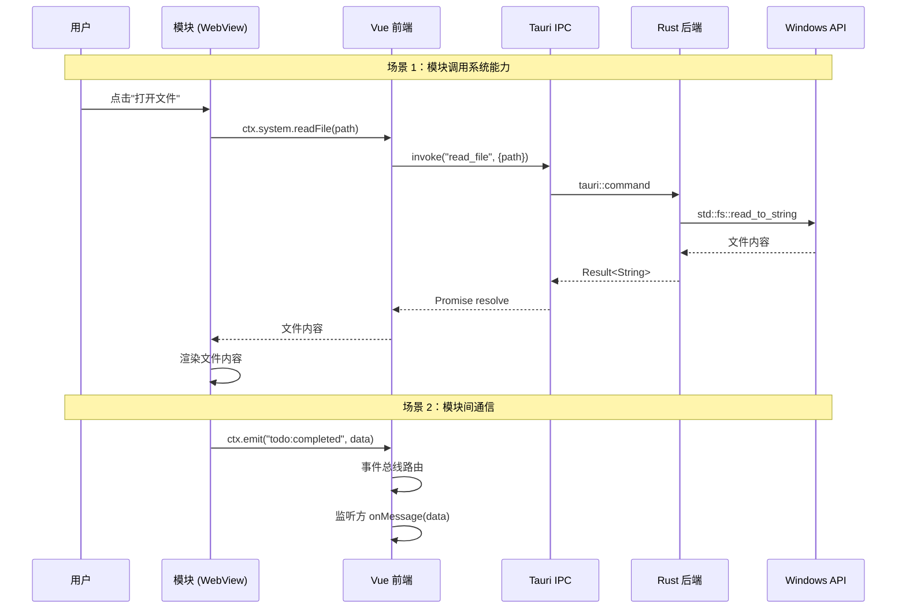

### 7.5 窗口属性与桌面交互

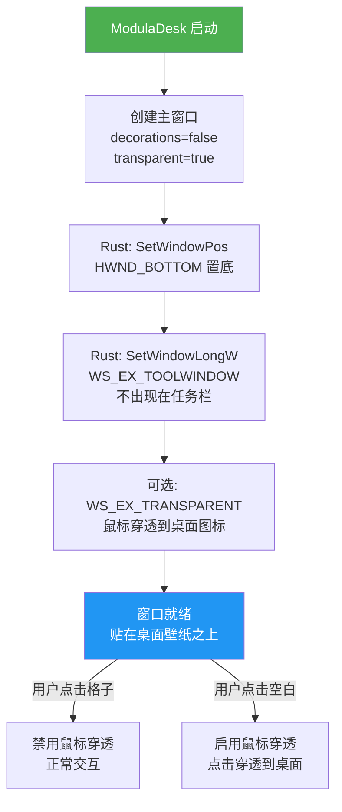

---

## 八、数据流

### 8.1 整体数据流

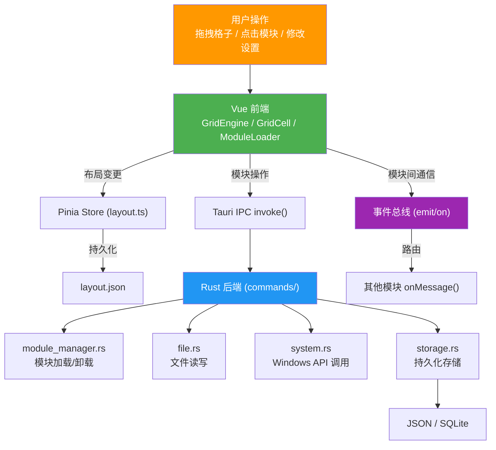

### 8.2 模块加载流程

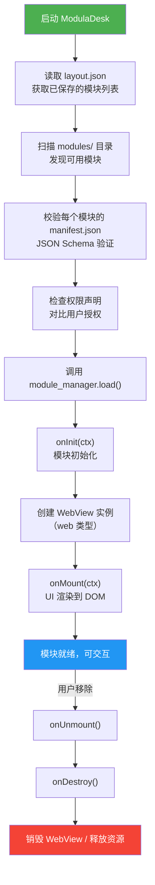

---

## 九、开发阶段

### 阶段依赖图

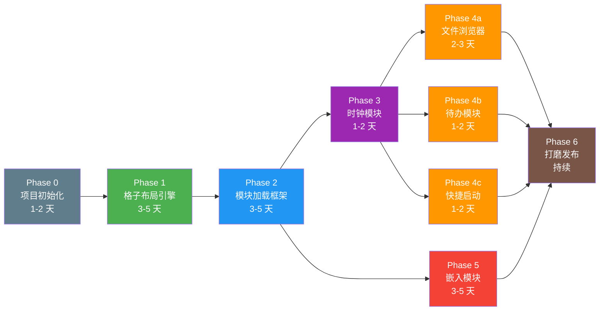

### Phase 0 — 项目初始化（1-2 天）

**前置：** 无

- [ ] `bun create tauri-app` 搭建骨架
- [ ] 配置 TypeScript、Vite、Pinia
- [ ] 确认 Tauri 2.x 环境可编译运行
- [ ] 配置 ESLint / Prettier / clippy
- [ ] 配置 tauri.conf.json 窗口属性（无边框、透明）

**可验证节点：Demo 0 — "Hello Window"**
```
操作步骤：
  1. git clone 项目
  2. bun install
  3. cargo tauri dev

预期结果：
  ✅ 弹出一个无边框、透明背景的窗口
  ✅ 窗口中显示 Vue 默认页面（带 Vite + Tauri logo）
  ✅ 窗口不出现在任务栏
  ✅ 关闭终端后进程正确退出
  ✅ 无编译警告、无运行时错误

验证命令：
  cargo tauri dev          # 应正常启动
  cargo clippy -- -D warnings  # 应无警告
```

---

### Phase 1 — 格子布局引擎（3-5 天）

**前置：** Phase 0

- [ ] 实现 GridEngine.vue（CSS Grid 或 vue-grid-layout）
- [ ] 实现 GridCell.vue（格子容器，支持拖拽、调整大小）
- [ ] 布局状态持久化（JSON 文件）
- [ ] 主窗口设置为无边框、透明背景、置底
- [ ] 基础 UI：顶部工具栏（添加/删除格子）
- [ ] 格子拖拽重排、吸附对齐

**可验证节点：Demo 1 — "能拖的格子"**
```
操作步骤：
  1. 启动 ModulaDesk
  2. 点击工具栏"添加格子"按钮，连续添加 3 个格子
  3. 拖拽格子 A 到新位置
  4. 拖拽格子 A 的右下角，调整大小
  5. 关闭 ModulaDesk
  6. 重新启动 ModulaDesk

预期结果：
  ✅ 3 个格子出现在网格中，半透明背景
  ✅ 格子可拖拽移动，松手后吸附到最近格子
  ✅ 格子可拖拽调整大小，受最小/最大约束
  ✅ 格子之间不会重叠（推挤生效）
  ✅ 关闭重启后，3 个格子的位置和大小完全保持
  ✅ 窗口置底，能看到桌面图标在格子下方
  ✅ 格子外的区域是透明的（能看到壁纸）

验证文件：
  cat %APPDATA%/ModulaDesk/layout.json
  # 应包含 3 个 LayoutItem，x/y/w/h 值正确
```

---

### Phase 2 — 模块加载框架（3-5 天）

**前置：** Phase 1

- [ ] 定义 manifest.json schema（JSON Schema 校验）
- [ ] 实现 ModuleLoader.vue（根据 manifest 渲染模块）
- [ ] 实现 Rust 侧 module_manager.rs（加载/卸载模块目录）
- [ ] 实现模块生命周期钩子（onInit → onMount → onUnmount → onDestroy）
- [ ] 实现 ModuleContext（storage、emit/on、system）
- [ ] 实现模块沙箱（权限控制）

**可验证节点：Demo 2 — "模块热插拔"**
```
前置准备：
  在 modules/ 下放一个最小测试模块 test-module/
  manifest.json: { "id": "test", "name": "测试", "type": "web", ... }
  index.ts: 在 onInit/onMount/onUnmount/onDestroy 各打印一行日志

操作步骤：
  1. 启动 ModulaDesk
  2. 观察控制台日志
  3. 通过 UI 将 test 模块添加到一个格子
  4. 观察控制台日志
  5. 从格子中移除该模块
  6. 观察控制台日志

预期结果：
  ✅ 启动时控制台打印 "扫描 modules/ 目录，发现 1 个模块"
  ✅ 添加时控制台按顺序打印：
     [test] onInit called
     [test] onMount called, container=<div>
  ✅ 移除时控制台按顺序打印：
     [test] onUnmount called
     [test] onDestroy called
  ✅ 模块 UI 正确渲染在格子中
  ✅ manifest.json 校验：手动改成无效格式，应跳过并打印错误，不崩溃

权限验证：
  ✅ 模块 manifest 中未声明 file:read，调用 ctx.system.readFile() 应抛出 PermissionError
  ✅ 声明了 file:read 后，调用应成功返回文件内容
```

---

### Phase 3 — 第一个内置模块：时钟（1-2 天）

**前置：** Phase 2

- [ ] 实现 clock 模块（web 类型）
- [ ] 验证完整流程：manifest → 加载 → 渲染 → 设置 → 持久化
- [ ] 作为后续模块的模板参考

**可验证节点：Demo 3 — "活的时钟"**
```
操作步骤：
  1. 启动 ModulaDesk
  2. 添加 clock 模块到格子
  3. 观察时间显示
  4. 打开 clock 模块设置，切换为 12h 制
  5. 开启"显示秒数"
  6. 调整格子大小（拉大/缩小）
  7. 关闭 ModulaDesk，重启

预期结果：
  ✅ 时钟显示当前时间，每秒更新
  ✅ 切换 12h 后显示 AM/PM
  ✅ 开启秒数后显示 HH:MM:SS
  ✅ 设置修改后立即生效，无需重启
  ✅ 重启后设置保持（12h + 显示秒数）
  ✅ 格子缩小时字体自适应（不溢出）
  ✅ 时钟模块目录可直接复制为新模块模板

验证文件：
  cat %APPDATA%/ModulaDesk/modules/clock/settings.json
  # 应包含 { "format24h": false, "showSeconds": true }
```

---

### Phase 4a — 文件浏览器模块（2-3 天）

**前置：** Phase 3

- [ ] 文件列表展示（图标 + 名称 + 大小 + 修改时间）
- [ ] 目录导航（面包屑 + 返回）
- [ ] 文件操作（打开、重命名、删除）
- [ ] 搜索过滤
- [ ] 参考 SecondDesk 的文件扫描逻辑

**可验证节点：Demo 4a — "我的文件"**
```
操作步骤：
  1. 添加 file-explorer 模块到一个大格子（4×3）
  2. 默认显示桌面文件列表
  3. 双击进入一个文件夹
  4. 点击面包屑返回上级
  5. 右键一个文件，选择"重命名"
  6. 在搜索框输入 ".pdf"
  7. 右键一个文件，选择"打开"

预期结果：
  ✅ 显示桌面文件列表，每个文件有图标、名称、大小、修改时间
  ✅ 双击文件夹进入，面包屑更新为 "桌面 > 文件夹名"
  ✅ 点击面包屑 "桌面" 返回根目录
  ✅ 重命名后文件名立即更新
  ✅ 搜索 ".pdf" 只显示 PDF 文件
  ✅ 点击"打开"用系统默认程序打开文件
  ✅ 文件列表 100 个文件时加载 < 100ms
```

---

### Phase 4b — 待办模块（1-2 天）

**前置：** Phase 3

- [ ] 添加/完成/删除待办
- [ ] 拖拽排序
- [ ] 持久化存储

**可验证节点：Demo 4b — "待办清单"**
```
操作步骤：
  1. 添加 todo 模块到格子
  2. 输入 "买菜" 回车，添加待办
  3. 输入 "写代码" 回车，添加第二条
  4. 点击 "买菜" 左边的勾选框，标记完成
  5. 拖拽 "写代码" 到 "买菜" 上方
  6. 点击 "买菜" 右边的删除按钮
  7. 关闭 ModulaDesk，重启

预期结果：
  ✅ "买菜" 出现删除线，变灰
  ✅ 拖拽后顺序变为 "写代码" → "买菜"
  ✅ 删除后只剩 "写代码"
  ✅ 重启后 "写代码" 仍在（持久化生效）
  ✅ 输入框为空时回车不添加
  ✅ 添加动画流畅（< 100ms）

验证文件：
  cat %APPDATA%/ModulaDesk/storage/todo/todos.json
  # 应只包含 "写代码" 一条记录
```

---

### Phase 4c — 快捷启动模块（1-2 天）

**前置：** Phase 3

- [ ] 常用应用/文件/URL 固定
- [ ] 拖拽添加
- [ ] 图标自动识别
- [ ] 点击启动

**可验证节点：Demo 4c — "一键启动"**
```
操作步骤：
  1. 添加 quick-launch 模块到格子
  2. 从文件管理器拖拽一个 .exe 文件到格子中
  3. 从文件管理器拖拽一个 .lnk 快捷方式到格子中
  4. 右键格子，选择"添加 URL"，输入 https://github.com
  5. 点击第一个 .exe 图标
  6. 点击 github.com 图标

预期结果：
  ✅ 拖入 .exe 后自动显示应用图标 + 名称
  ✅ 拖入 .lnk 后自动识别目标程序图标
  ✅ 添加 URL 后显示网站 favicon + 域名
  ✅ 点击 .exe 图标启动对应程序
  ✅ 点击 URL 图标用默认浏览器打开
  ✅ 关闭重启后快捷方式保持
  ✅ 图标加载 < 50ms
```

---

### Phase 5 — 嵌入模块探索（3-5 天）

**前置：** Phase 2（可与 Phase 4 并行）

- [ ] 调研 SetParent 嵌入方案（把外部窗口塞进格子）
- [ ] 实现 embedded 类型的基础加载器
- [ ] 尝试嵌入 Windows Terminal 或 Claude Code
- [ ] 评估可行性和性能

**可验证节点：Demo 5 — "窗口里的窗口"**
```
操作步骤：
  1. 打开 Windows Terminal
  2. 在 ModulaDesk 中添加 embedded 模块，配置目标为 "WindowsTerminal"
  3. 观察 Terminal 窗口是否嵌入格子
  4. 调整格子大小
  5. 在嵌入的 Terminal 中输入命令
  6. 关闭嵌入的 Terminal 进程

预期结果：
  ✅ Terminal 窗口出现在格子区域内
  ✅ 格子调整大小时，Terminal 跟随缩放
  ✅ 可以在嵌入的 Terminal 中正常输入和执行命令
  ✅ Terminal 关闭/崩溃时，格子显示"应用已退出"提示
  ✅ 不影响其他模块正常运行
  ✅ 内存占用：嵌入 1 个 Terminal 额外增加 < 50MB

降级验证（如果 SetParent 失败）：
  ✅ 改用 IPC + xterm.js 方案
  ✅ 终端输出实时显示在格子中
  ✅ 可以输入命令并执行

输出文档：
  docs/embedded-module-report.md
  - 测试了哪些应用
  - 哪些能嵌入、哪些不能
  - 性能数据
  - 最终推荐方案
```

---

### Phase 6 — 打磨与发布（持续）

**前置：** Phase 4 + Phase 5

- [ ] 主题系统（深色/浅色/跟随系统）
- [ ] 模块安装/卸载 UI
- [ ] 打包为 Windows 安装程序（.msi / .exe）
- [ ] 自动更新（可选）
- [ ] 性能优化（懒加载、虚拟列表）
- [ ] 错误处理与崩溃恢复

**可验证节点：Demo 6 — "完整产品"**
```
操作步骤：
  1. 运行打包后的 .exe 安装程序
  2. 完成安装，启动 ModulaDesk
  3. 添加 5 个不同类型模块（clock + todo + file-explorer + quick-launch + embedded）
  4. 切换深色/浅色主题
  5. 拖入一个 .mdmod 文件安装新模块
  6. 运行 30 分钟，观察内存变化
  7. 故意让一个模块崩溃（注入错误），观察其他模块

预期结果：
  ✅ 安装程序正常安装，桌面和开始菜单有快捷方式
  ✅ 5 个模块同时运行，总内存 < 500MB
  ✅ 主题切换后所有模块 UI 跟随变化
  ✅ .mdmod 文件拖入后自动识别，安装成功
  ✅ 崩溃的模块显示错误 UI，其他 4 个不受影响
  ✅ 运行 30 分钟内存无明显泄漏（增长 < 50MB）
  ✅ 格子拖拽全程 60fps 无卡顿

性能基准（记录到文档）：
  冷启动时间：___ms
  5 模块内存：___MB
  格子拖拽帧率：___fps
  布局保存延迟：___ms
```

---

## 十、示例模块：时钟

完整的 clock 模块实现，作为新模块的模板。

### manifest.json

```json
{
  "id": "clock",
  "name": "时钟",
  "version": "1.0.0",
  "author": "judy",
  "description": "桌面时钟小组件",
  "icon": "🕐",
  "grid": {
    "minWidth": 2,
    "minHeight": 1,
    "maxWidth": 4,
    "maxHeight": 2,
    "defaultWidth": 2,
    "defaultHeight": 1,
    "resizable": true
  },
  "type": "web",
  "permissions": [],
  "settings": {
    "format24h": {
      "type": "boolean",
      "default": true,
      "label": "24 小时制"
    },
    "showSeconds": {
      "type": "boolean",
      "default": false,
      "label": "显示秒数"
    }
  }
}
```

### index.ts

```typescript
import type { Module, ModuleContext } from '../../src/types/module';

const clock: Module = {
  async onInit(ctx: ModuleContext) {
    console.log(`[clock] 初始化, moduleId=${ctx.moduleId}`);
  },

  async onMount(ctx: ModuleContext) {
    const { container, settings } = ctx;

    // 创建时钟 DOM
    container.innerHTML = `
      <div class="clock-widget">
        <div class="clock-time" id="time">--:--</div>
        <div class="clock-date" id="date">----/--/--</div>
      </div>
      <style>
        .clock-widget {
          display: flex;
          flex-direction: column;
          align-items: center;
          justify-content: center;
          height: 100%;
          font-family: 'Segoe UI', sans-serif;
          color: #fff;
          text-shadow: 0 1px 3px rgba(0,0,0,0.3);
        }
        .clock-time {
          font-size: 3rem;
          font-weight: 300;
          letter-spacing: 2px;
        }
        .clock-date {
          font-size: 0.9rem;
          opacity: 0.8;
          margin-top: 4px;
        }
      </style>
    `;

    // 启动定时器
    const update = () => {
      const now = new Date();
      const timeEl = container.querySelector('#time')!;
      const dateEl = container.querySelector('#date')!;

      const use24h = settings.format24h !== false;
      const showSec = settings.showSeconds === true;

      let hours = now.getHours();
      const ampm = use24h ? '' : (hours >= 12 ? ' PM' : ' AM');
      if (!use24h) hours = hours % 12 || 12;

      const h = String(hours).padStart(2, '0');
      const m = String(now.getMinutes()).padStart(2, '0');
      const s = String(now.getSeconds()).padStart(2, '0');

      timeEl.textContent = showSec ? `${h}:${m}:${s}${ampm}` : `${h}:${m}${ampm}`;
      dateEl.textContent = now.toLocaleDateString('zh-CN', {
        year: 'numeric', month: '2-digit', day: '2-digit', weekday: 'short'
      });
    };

    update();
    (ctx as any)._timer = setInterval(update, 1000);
  },

  async onUnmount() {
    // 清理定时器
    if ((this as any)._timer) {
      clearInterval((this as any)._timer);
    }
  },

  onSettingsChange(key: string, value: any) {
    console.log(`[clock] 设置变更: ${key}=${value}`);
    // 设置变更后 onUnmount + onMount 会重新触发，无需手动处理
  },

  onResize(width: number, height: number) {
    // 根据格子大小调整字体
    console.log(`[clock] 尺寸变更: ${width}x${height}`);
  }
};

export default clock;
```

### 创建新模块的步骤

```bash
# 1. 复制 clock 模块作为模板
cp -r modules/clock modules/my-module

# 2. 修改 manifest.json
#    - 改 id、name、description、icon
#    - 调整 grid 约束
#    - 声明需要的 permissions
#    - 定义 settings schema

# 3. 修改 index.ts
#    - 实现 Module 接口的生命周期钩子
#    - 在 onMount 中构建 UI

# 4. 重启 ModulaDesk（或未来支持热加载）
```

---

## 十一、依赖清单

### Rust 侧 (Cargo.toml)

```toml
[dependencies]
tauri = { version = "2", features = ["tray-icon"] }
tauri-plugin-shell = "2"
serde = { version = "1", features = ["derive"] }
serde_json = "1"
tokio = { version = "1", features = ["full"] }
windows = { version = "0.58", features = [
    "Win32_UI_WindowsAndMessaging",
    "Win32_Foundation",
    "Win32_Graphics_Dwm",
] }
uuid = { version = "1", features = ["v4"] }
dirs = "5"                        # 获取系统目录路径
notify = "6"                      # 文件变化监听
```

### 前端侧 (package.json 关键依赖)

```jsonc
{
  "dependencies": {
    "vue": "^3.5",
    "pinia": "^2.2",
    "@tauri-apps/api": "^2.0",
    "vue-grid-layout": "^3.0"     // 或自研替代
  },
  "devDependencies": {
    "@tauri-apps/cli": "^2.0",
    "typescript": "^5.5",
    "vite": "^6.0",
    "@vitejs/plugin-vue": "^5.0",
    "vue-tsc": "^2.0"
  }
}
```

---

## 十二、关键决策点

| 决策 | 选项 | 当前倾向 | 待定 |
|------|------|---------|------|
| 格子常驻 vs 抽屉式 | 常驻 / 抽屉 / 混合 | 待定 | ✅ |
| 格子布局方案 | vue-grid-layout / 自研 CSS Grid | 自研（更可控） | ✅ |
| 模块沙箱隔离 | 同一 WebView / 独立 WebView / iframe | 独立 WebView | ✅ |
| 嵌入方案 | SetParent / IPC / xterm.js | 待调研 | ✅ |
| 配置存储 | JSON / SQLite | JSON（初期够用） | ✅ |
| 模块包格式 | ZIP / 文件夹 / npm 包 | 文件夹（开发期）→ ZIP | ✅ |

---

## 十三、风险与应对

| 风险 | 影响 | 应对 |
|------|------|------|
| 嵌入原生窗口效果差 | embedded 模块不可用 | 优先用 web 类型重渲染，SetParent 作为备选 |
| WebView2 内存占用高 | 多模块时卡顿 | 限制同时活跃的模块数，懒加载不可见模块 |
| 格子布局交互复杂 | 开发周期拉长 | 先用 vue-grid-layout 快速验证，再考虑自研 |
| Tauri 2.x API 变动 | 需要适配 | 锁定版本，关注 changelog |
| 模块权限安全 | 恶意模块风险 | 个人使用风险低，但接口要预留权限控制 |

---

## 十四、当前状态

**阶段：** Phase 0 之前 — 需求确认与架构设计

**已完成：**
- [x] 竞品调研（16 个项目）
- [x] 技术栈选定（Rust + Tauri 2.x + Vue 3）
- [x] 模块接口规范草案
- [x] 项目执行文档

**下一步：**
- [ ] 确认格子常驻 vs 抽屉式
- [ ] 确认模块接口规范是否需要调整
- [ ] 开始 Phase 0：搭建项目骨架

---

## 十五、技术约束与已知限制

| 约束 | 说明 | 影响 |
|------|------|------|
| WebView2 限制 | 每个 WebView 实例约占 30-50MB 内存 | 模块数量有上限，10 个以上可能卡顿 |
| SetParent 兼容性 | 部分应用（UWP/WinUI 3）不支持 SetParent | embedded 模块可能只能嵌入 Win32 应用 |
| 透明窗口性能 | 透明背景 + 多 WebView 有 GPU 开销 | 低端显卡可能出现撕裂 |
| Tauri 2.x 成熟度 | 相对较新，部分 API 可能变动 | 需要锁定版本，升级时仔细测试 |
| 文件监控 | notify crate 在大量文件时有性能问题 | 文件浏览器模块需要增量扫描 |
| WebView2 脚本注入 | 模块 UI 在 WebView 中运行，有沙箱限制 | 不能直接访问文件系统，必须通过 IPC |

---

## 十六、未来扩展方向

- [ ] 模块市场（在线下载安装社区模块）
- [ ] 跨平台支持（macOS/Linux，Tauri 天然支持）
- [ ] 云端同步（布局和配置跨设备同步）
- [ ] AI 集成（自然语言创建模块、智能文件分类）
- [ ] 手势/语音触发（边缘滑动、语音命令）
- [ ] 模块组合（多个模块组成工作区，一键切换）

---

## 十七、格子布局引擎设计

### 17.1 格子坐标系统

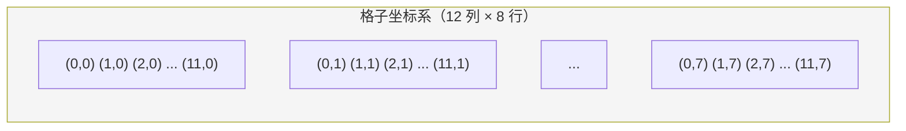

**设计参数：**
- 列数：12 列（可整除 1/2/3/4/6/12，方便布局）
- 行数：按屏幕高度自适应（每行约 80-120px）
- 格子间距：8px
- 最小模块：1×1（约 100×80px）
- 最大模块：12×8（全屏）

### 17.2 布局数据结构

```typescript
// layout.json
interface Layout {
  columns: number;        // 总列数（默认 12）
  rowHeight: number;      // 每行高度（px）
  gap: number;            // 格子间距（px）
  items: LayoutItem[];
}

interface LayoutItem {
  moduleId: string;       // 关联的模块 ID
  instanceId: string;     // 实例 ID（同模块可多实例）
  x: number;              // 左上角列号
  y: number;              // 左上角行号
  w: number;              // 宽度（列数）
  h: number;              // 高度（行数）
  minW?: number;          // 最小宽度约束（来自 manifest）
  minH?: number;          // 最小高度约束
  maxW?: number;          // 最大宽度约束
  maxH?: number;          // 最大高度约束
  locked?: boolean;       // 锁定位置（不可拖拽）
}
```

### 17.3 拖拽与调整大小算法

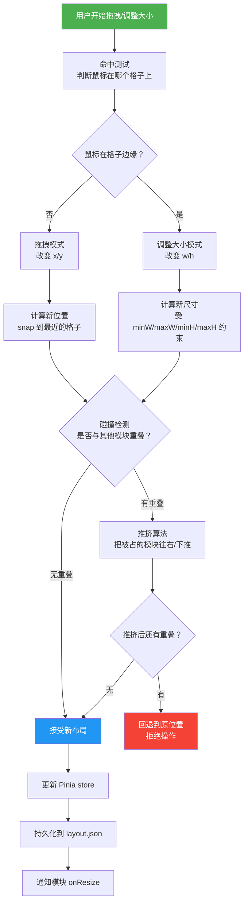

### 17.4 响应式布局

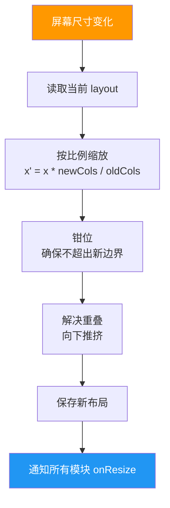

---

## 十八、错误处理与容错

### 18.1 模块崩溃隔离

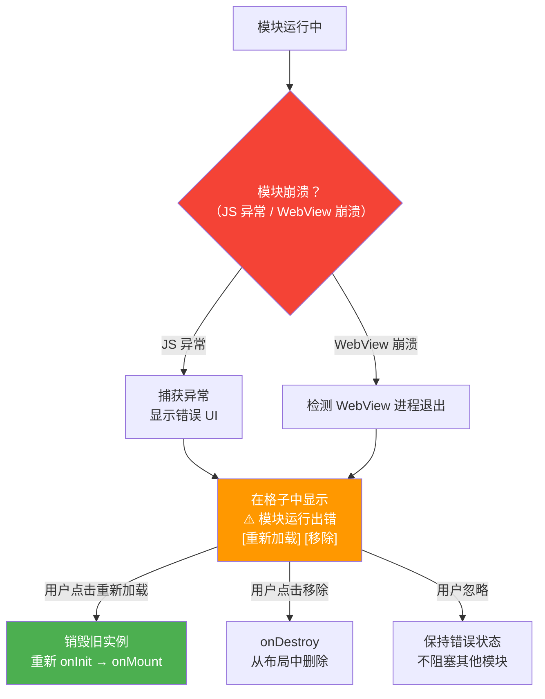

**关键原则：一个模块崩溃不影响其他模块和宿主。**

### 18.2 错误类型与处理策略

| 错误类型 | 示例 | 处理策略 |
|---------|------|---------|
| 模块 JS 异常 | 运行时 TypeError | 捕获，显示错误 UI，允许重新加载 |
| WebView 崩溃 | 内存不足 OOM | 检测进程退出，自动重启 WebView |
| manifest 校验失败 | JSON 格式错误 | 跳过该模块，日志记录，不影响其他模块 |
| 权限拒绝 | 模块访问未授权 API | 返回错误给模块，模块自行处理 |
| IPC 超时 | Rust 后端处理过慢 | 30s 超时，返回 TimeoutError |
| 布局文件损坏 | layout.json 被改坏 | 回退到默认布局，备份损坏文件 |

---

## 十九、配置管理

### 19.1 配置文件结构

```
%APPDATA%/ModulaDesk/
├── layout.json               # 格子布局（位置、大小、关联模块）
├── settings.json             # 全局设置（主题、快捷键、行为）
├── modules/
│   ├── clock/
│   │   └── settings.json     # clock 模块的用户配置
│   ├── file-explorer/
│   │   └── settings.json
│   └── todo/
│       └── settings.json
├── storage/
│   ├── clock/                # clock 模块的持久化数据
│   │   └── data.json
│   └── todo/
│       └── todos.json
├── logs/
│   └── moduladesk.log        # 运行日志
└── backups/
    └── layout.2026-05-08.json.bak  # 布局备份
```

### 19.2 全局设置 schema

```jsonc
// settings.json
{
  "theme": "dark",              // "dark" | "light" | "system"
  "language": "zh-CN",          // 界面语言
  "grid": {
    "columns": 12,
    "rowHeight": 100,
    "gap": 8,
    "snapToGrid": true          // 拖拽时吸附到格子
  },
  "window": {
    "position": "fullscreen",   // "fullscreen" | "custom"
    "customBounds": null,       // 自定义位置/大小
    "clickThrough": false,      // 鼠标穿透
    "autoHide": false           // 自动隐藏（抽屉模式用）
  },
  "shortcuts": {
    "toggleVisibility": "Ctrl+Shift+D",   // 显示/隐藏
    "addModule": "Ctrl+Shift+A",          // 添加模块
    "lockLayout": "Ctrl+Shift+L",         // 锁定布局
    "settings": "Ctrl+,"                   // 打开设置
  },
  "performance": {
    "maxActiveModules": 10,     // 最大同时活跃模块数
    "lazyLoad": true,           // 不可见模块延迟加载
    "suspendHidden": true       // 隐藏模块暂停渲染
  },
  "modules": {
    "autoDiscover": true,       // 自动发现 modules/ 目录
    "allowUnsigned": true       // 允许未签名模块（个人使用）
  }
}
```

---

## 二十、快捷键系统

### 20.1 全局快捷键架构

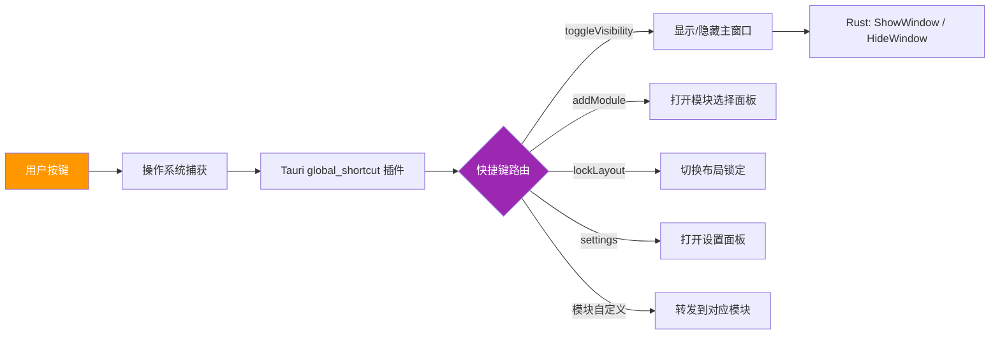

### 20.2 快捷键注册

```rust
// src-tauri/src/core/shortcuts.rs
use tauri_plugin_global_shortcut::{Code, GlobalShortcutExt, Modifiers};

pub fn register_shortcuts(app: &mut tauri::App) -> Result<(), Box<dyn std::error::Error>> {
    app.global_shortcut().on_shortcut(
        Modifiers::CONTROL | Modifiers::SHIFT,
        Code::KeyD,
        |app, _shortcut, event| {
            if event.state == tauri_plugin_global_shortcut::ShortcutState::Pressed {
                toggle_window_visibility(app);
            }
        },
    )?;
    Ok(())
}
```

---

## 二十一、系统托盘

### 21.1 托盘菜单结构

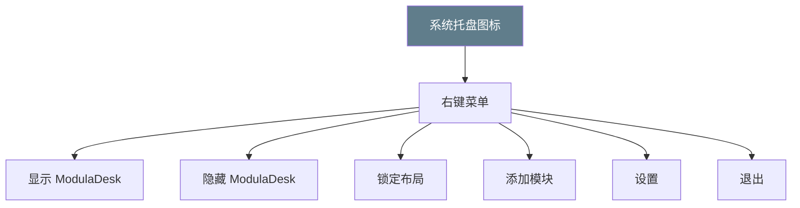

### 21.2 托盘行为

| 事件 | 行为 |
|------|------|
| 左键点击 | 切换显示/隐藏 |
| 右键点击 | 弹出菜单 |
| 双击 | 打开设置 |
| 模块通知 | 托盘图标气泡提示 |

---

## 二十二、模块打包与分发

### 22.1 模块包结构（.mdmod）

```
my-module.mdmod (ZIP 格式，改扩展名)
├── manifest.json
├── index.ts (或编译后的 index.js)
├── ui/
│   ├── index.html
│   ├── style.css
│   └── main.js
└── icon.png (可选)
```

### 22.2 安装流程

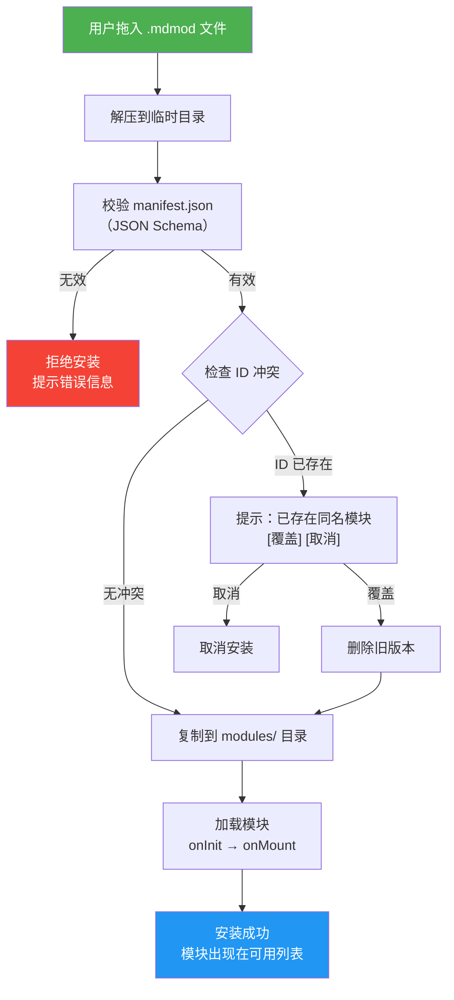

---

## 二十三、性能优化策略

### 23.1 内存管理

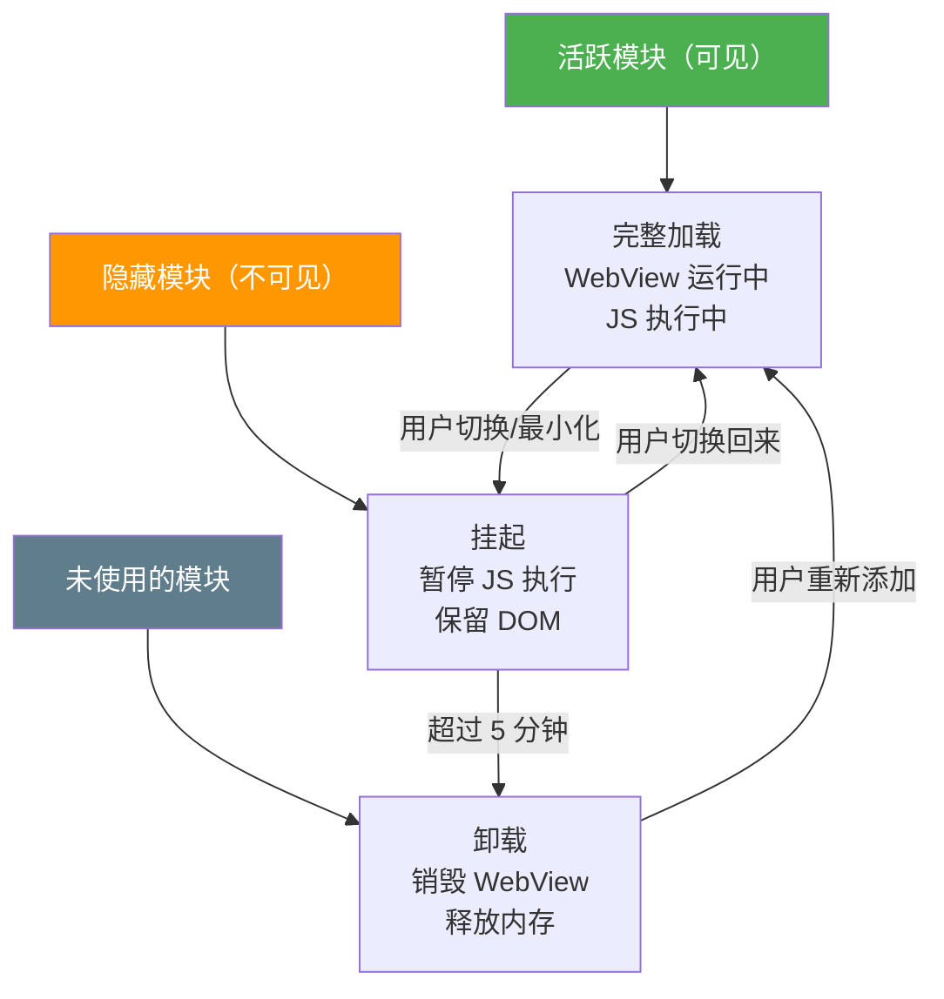

### 23.2 性能指标

| 指标 | 目标值 | 说明 |
|------|--------|------|
| 冷启动时间 | <2s | 从启动到所有模块就绪 |
| 模块加载时间 | <500ms | 单个模块从 onInit 到 onMount |
| 内存占用（5 模块） | <300MB | 5 个 web 类型模块 |
| 内存占用（10 模块） | <500MB | 含 2 个 native 类型 |
| 格子拖拽帧率 | 60fps | 流畅无卡顿 |
| 布局持久化延迟 | <100ms | 保存到 JSON 的时间 |

### 23.3 懒加载策略

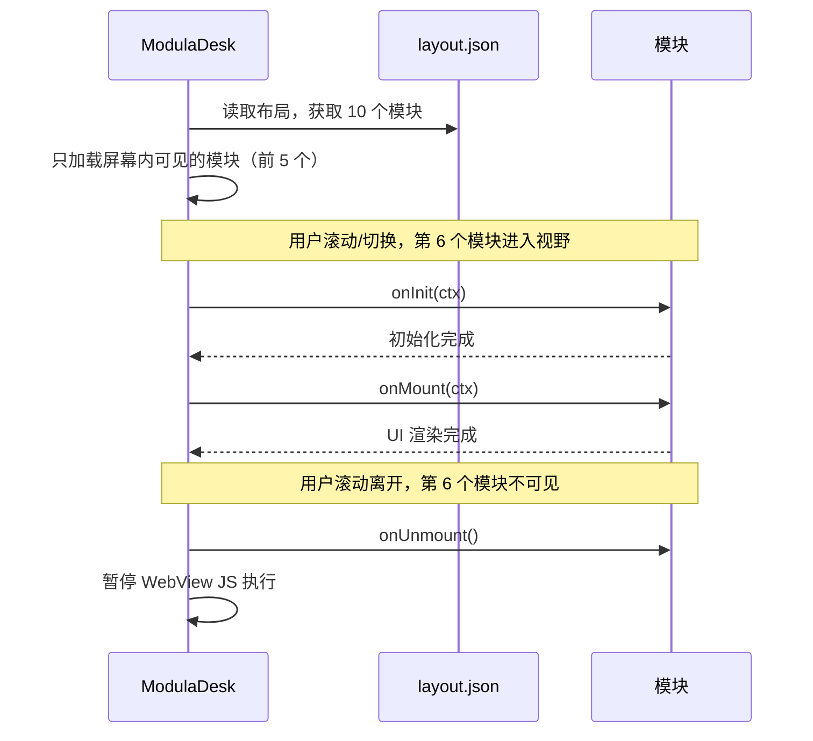

---

## 二十四、测试策略

### 24.1 测试分层

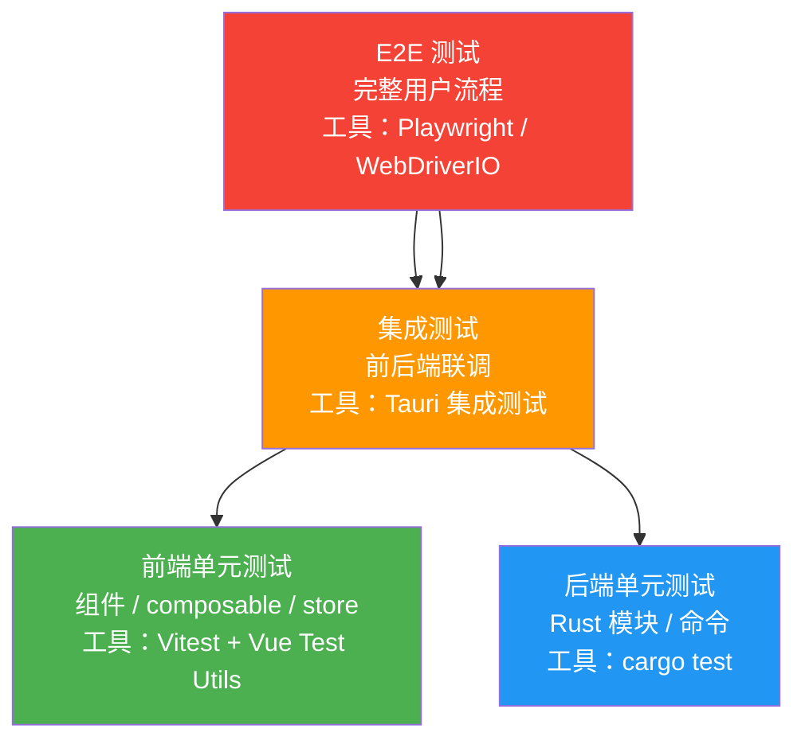

### 24.2 各阶段测试重点

| Phase | 测试重点 | 测试类型 |
|-------|---------|---------|
| Phase 0 | 项目可编译运行 | 冒烟测试 |
| Phase 1 | 格子拖拽/调整大小/持久化 | 单元 + 集成 |
| Phase 2 | 模块加载/卸载/生命周期 | 单元 + 集成 |
| Phase 3 | clock 模块完整流程 | E2E |
| Phase 4 | 多模块共存/通信/性能 | 集成 + E2E |
| Phase 5 | 嵌入窗口稳定性 | 手动 + E2E |
| Phase 6 | 全流程回归 | E2E |

### 24.3 模块测试规范

```typescript
// 模块开发者应提供的测试
describe('clock module', () => {
  it('should render time in 24h format', async () => {
    const ctx = createMockContext({ format24h: true });
    await clock.onMount(ctx);
    expect(ctx.container.querySelector('#time')).toContainText(/^\d{2}:\d{2}$/);
  });

  it('should respect settings changes', async () => {
    const ctx = createMockContext({ format24h: false });
    await clock.onMount(ctx);
    expect(ctx.container.querySelector('#time')).toContainText(/AM|PM/);
  });

  it('should clean up on unmount', async () => {
    const ctx = createMockContext();
    await clock.onMount(ctx);
    await clock.onUnmount();
    // 确认定时器已清理
  });
});
```

---

## 二十五、开发工具与调试

### 25.1 调试技巧

| 场景 | 方法 |
|------|------|
| 调试前端 Vue 组件 | `cargo tauri dev` 后，Chrome 打开 `http://localhost:1420`，用 Vue DevTools |
| 调试 Rust 后端 | `println!` / `tracing` 日志，或用 VS Code + CodeLLDB 调试 |
| 调试模块 WebView | 每个模块 WebView 可通过 `--inspect` 参数开启 DevTools |
| 查看 IPC 通信 | Tauri DevTools 的 Network 面板可查看 IPC 调用 |
| 查看内存占用 | Process Explorer 查看每个 WebView 进程的内存 |

### 25.2 开发模式特性

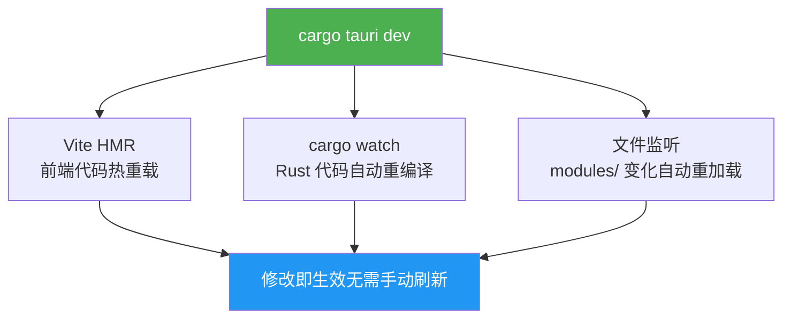

---

*本文档随项目进展持续更新。最后更新：2026-05-08*
